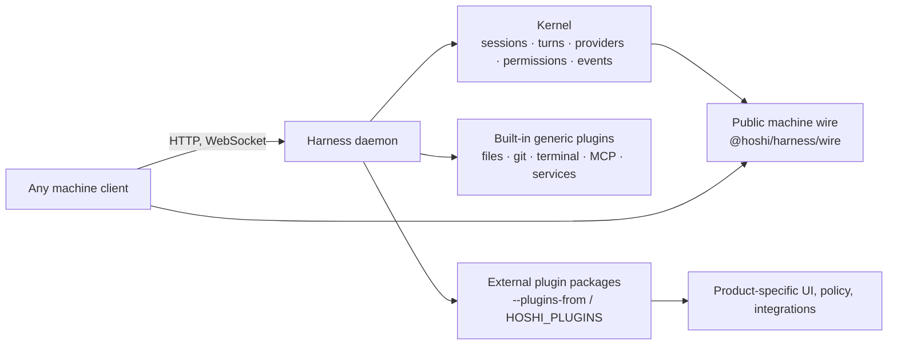

# Architecture

`@hoshi/harness` is deliberately the smallest durable runtime that can host a
machine. It owns no product UI or organization-specific feature.

The arrow into the daemon is ordinary HTTP/WebSocket traffic. The arrow into an
external plugin is an in-process module load: a plugin is not a sidecar and does
not get a second kernel. The daemon rejects a plugin made by another installed
copy of the harness, because that copy would register tools and routes that the
running machine cannot serve.

## Ownership test

| Belongs in the harness | Belongs in a plugin |
| --- | --- |
| Live machine primitives: a turn, file, terminal, provider, event stream | A product's UI protocol or design-system vocabulary |
| A generic capability useful to a standalone machine | Organization policy, billing, tenancy, or provisioning |
| The plugin contract and lifecycle | A vendor integration or branded workflow |

When a capability needs a product client to make sense, implement it as a
plugin. The harness should still be useful and comprehensible when that plugin
is absent.
