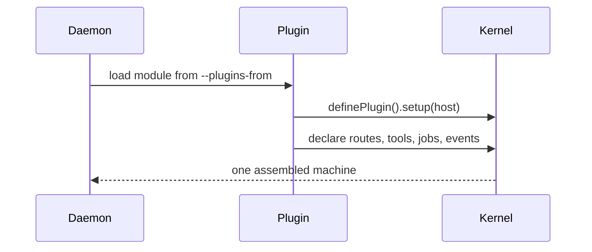
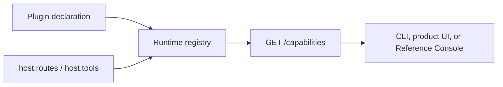

# Write a plugin

Plugins add capabilities to a running harness without changing its kernel.



## Minimal plugin

```ts
import { definePlugin } from '@hoshi/harness'

export default [
  definePlugin({
    name: 'greetings',
    description: 'A small example capability',
    capability: {
      id: 'greetings.hello',
      title: 'Greetings',
      description: 'Returns a friendly greeting.',
    },
    setup(host) {
      host.routes.get('/greetings', () => ({ greeting: 'hello' }))
    },
  }),
]
```

Start it with:

```sh
hoshi-harness --plugins-from @example/greetings
```

The package must declare `@hoshi/harness` as a peer dependency and resolve it to
the daemon's installed copy. This is essential: a plugin built against a second
copy gets rejected before boot, rather than silently registering with an unused
kernel.

Use `host.routes`, `host.tools`, `host.events`, and `host.jobs` to contribute
behaviour. Do not import internal harness paths; only the package root and its
`/wire` export are stable public APIs.

## Install a declared remote MCP connector

An external product plugin can install a remote connector through the MCP
plugin's public port. Declare `uses: ['mcpConnectors']`; do not import MCP
storage, routes, OAuth helpers, or call the machine's own HTTP API.

The MCP plugin continues to expose its normal machine-local configuration and
status routes for clients that configure a connector manually. Harness does not
publish an MCP marketplace, featured catalogue, or third-party registry-search
route. A product that curates connectors owns that catalogue itself and declares
the selected connector through this port.

```ts
import { definePlugin, type McpConnectorPort } from '@hoshi/harness'

export default [
  definePlugin({
    name: 'example-packs',
    description: 'Installs example integrations.',
    uses: ['mcpConnectors'],
    setup(host) {
      const connectors: McpConnectorPort | undefined = host.ports.mcpConnectors
      if (!connectors) return

      void connectors.install({
        name: 'example',
        transport: 'http',
        url: 'https://mcp.example.com/',
        vaultHeaders: {
          Authorization: { key: 'EXAMPLE_TOKEN', template: 'Bearer {{secret}}' },
        },
      })
    },
  }),
]
```

The port accepts remote `http` or `sse` transports at `http:`/`https:` URLs;
it has no stdio or literal-header path. A vault binding names a machine vault
key and one of two templates: `{{secret}}` or `Bearer {{secret}}`. The binding,
not the secret value, is stored; its value is read only immediately before the MCP
plugin dials the server. If your pack format calls its placeholder
`{{credential}}`, translate it to `{{secret}}` and map the declared credential
to its machine vault key before calling the port.

To begin machine-owned OAuth DCR from one of your authenticated routes, pass
that incoming request's headers. Discovery, registration, PKCE, callback,
refresh and tokens remain inside the MCP plugin:

```ts
const result = await host.ports.mcpConnectors?.beginDcrAuthorization({
  name: 'example',
  request: { headers: event.node.req.headers },
  scopes: ['read:documents'],
})
// return or redirect to result?.url; never handle a token in this plugin.
```

`status(name)` returns only name, connection state, OAuth state and tool count.
It never returns an endpoint, vault binding, token, or secret value.

### Use a product-brokered short-lived token

When an organization owns the OAuth relationship, bind a runtime token source
from the product plugin and declare its non-secret id on the connector. The MCP
plugin asks the resolver only while it is about to dial; it writes neither the
access token it receives nor a refresh token or client secret to `mcp.json`.

```ts
import { definePlugin } from '@hoshi/harness'

export default [
  definePlugin({
    name: 'example-platform',
    description: 'Makes organization-brokered connectors available.',
    uses: ['mcpConnectors'],
    setup(host) {
      const connectors = host.ports.mcpConnectors
      if (!connectors) return

      connectors.bindTokenSource('platform.example', async ({ name, scopes }) => {
        const token = await mintShortLivedTokenFromYourPlatform({ name, scopes })
        return token ? { state: 'available', accessToken: token } : { state: 'unavailable' }
      })

      void connectors.install({
        name: 'example',
        transport: 'http',
        url: 'https://mcp.example.com/',
        tokenSource: { id: 'platform.example', scopes: ['documents.read'] },
      })
    },
  }),
]
```

Bind the source during every plugin setup. Source bindings are process-local by
design, so a restart begins unbound; a stored connector whose source was not
registered is visibly `unreachable` with `needs-auth` rather than being dialled
without a credential. Resolver outcomes are sanitized: an expired token reports
`expired`; unavailable, revoked, or failed broker requests report `needs-auth`.
Do not return provider errors or token metadata. A connector uses either
`tokenSource` or `vaultHeaders`, never both; DCR remains the machine-owned OAuth
path above.

## Describe what the machine can do

`capability` is the public, stable identity of the unit your plugin adds. Its
ID must begin with the plugin name (`greetings.hello` for `greetings`), is
validated before startup, and cannot be claimed by another loaded plugin.
The Harness supplies the mutable facts itself: whether setup succeeded, the
routes and tools you registered, and the system dependencies and ports you
declared.



`GET /capabilities` is owner-authenticated and is for rendering, discovery,
and diagnosis — not authorization. It never makes a route or tool accessible;
those keep their own checks. See [Capability Passport](./capability-passport.md)
for the full wire contract.

During the pre-1.0 migration, `capability` is optional for existing external
plugins. Such a plugin still runs, but is absent from the Passport. New plugins
should always declare it; it becomes mandatory at the 1.0 compatibility
boundary.

## Product conventions

If a plugin needs standing guidance for an agent, or owns a tool that only
changes the current conversation, it can compose the corresponding ports:

```ts
setup(host) {
  host.provide((current) => ({
    ...current,
    agentInstructions: () => [...(current.agentInstructions?.() ?? []), '## Example\n\nUse example_card for decisions.'],
    systemToolNames: () => [...(current.systemToolNames?.() ?? []), 'example_card'],
  }))
}
```

`agentInstructions` is added at turn construction; it never writes the user's
`AGENTS.md`. `systemToolNames` is only for tools with no effect beyond the
conversation. Any tool that writes, sends data, starts work, or reaches another
service must remain governed.
