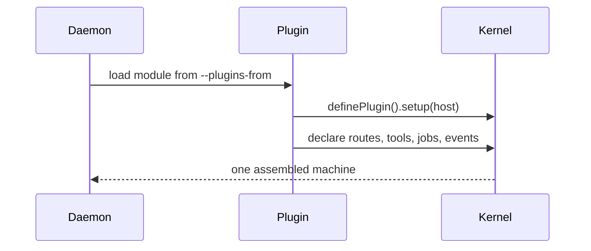

# Write a plugin

Plugins add capabilities to a running harness without changing its kernel.



## Minimal plugin

```ts
import { definePlugin } from '@hoshi/harness'

export default [
  definePlugin({
    name: 'greetings',
    description: 'A small example capability',
    setup(host) {
      host.routes.get('/greetings', () => ({ greeting: 'hello' }))
    },
  }),
]
```

Start it with:

```sh
hoshi-harness --plugins-from @example/greetings
```

The package must declare `@hoshi/harness` as a peer dependency and resolve it to
the daemon's installed copy. This is essential: a plugin built against a second
copy gets rejected before boot, rather than silently registering with an unused
kernel.

Use `host.routes`, `host.tools`, `host.events`, and `host.jobs` to contribute
behaviour. Do not import internal harness paths; only the package root and its
`/wire` export are stable public APIs.

## Product conventions

If a plugin needs standing guidance for an agent, or owns a tool that only
changes the current conversation, it can compose the corresponding ports:

```ts
setup(host) {
  host.provide((current) => ({
    ...current,
    agentInstructions: () => [...(current.agentInstructions?.() ?? []), '## Example\n\nUse example_card for decisions.'],
    systemToolNames: () => [...(current.systemToolNames?.() ?? []), 'example_card'],
  }))
}
```

`agentInstructions` is added at turn construction; it never writes the user's
`AGENTS.md`. `systemToolNames` is only for tools with no effect beyond the
conversation. Any tool that writes, sends data, starts work, or reaches another
service must remain governed.
